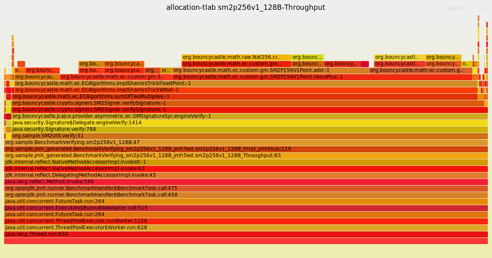
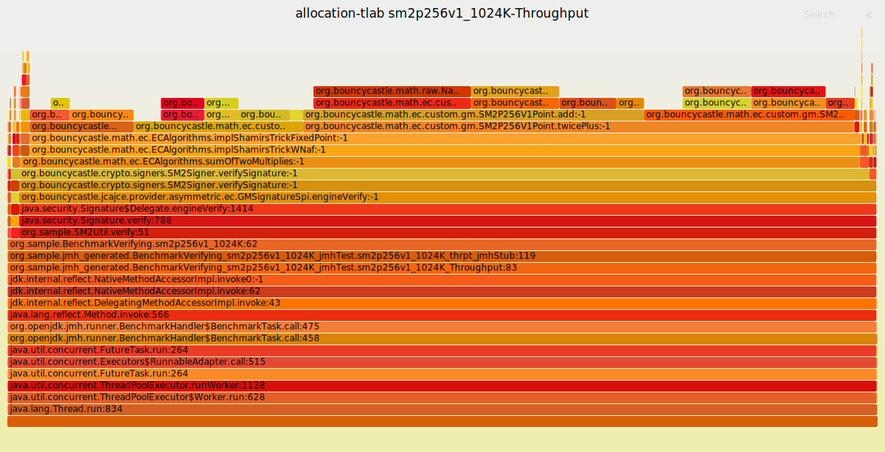
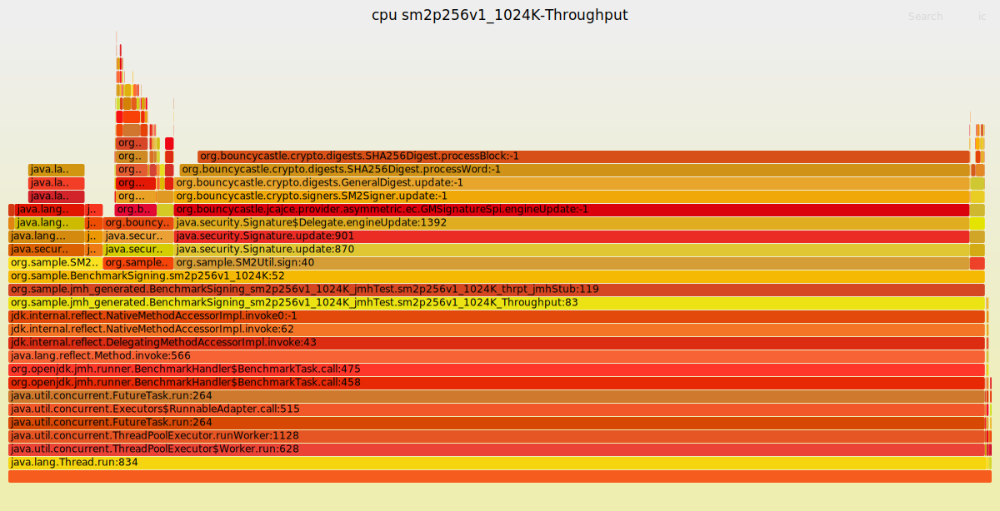
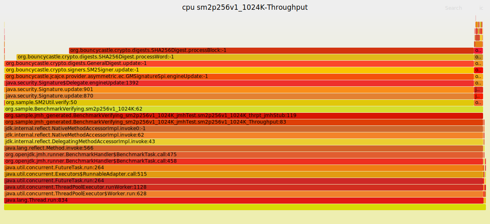
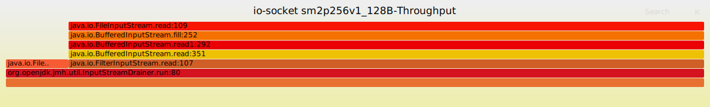
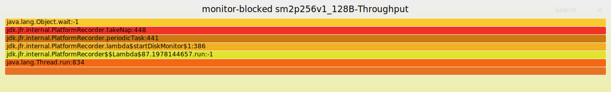

# JMH Performance test for digital signature using sm2p256v1 SHA256withSM2 with Bouncy Castle
Use JDK 11.

Test full procedure of the digital signature, including computing the signature as well as verifying the signature.

Using Java Flight Recorder(JFR) as the profiler.

## Build
```sh
mvn clean verify
```

## Run
```sh
java -jar target/benchmarks.jar -prof jfr
```

## Result
[result logs](result.log)

### allocation-tlab
#### 128B Signing


#### 256B Signing


#### 1024B Signing


#### 1024K Signing


#### 128B Verifying


#### 256B Verifying


#### 1024B Verifying


#### 1024K Verifying


### cpu
#### 128B Signing


#### 256B Signing


#### 1024B Signing


#### 1024K Signing


#### 128B Verifying


#### 256B Verifying


#### 1024B Verifying


#### 1024K Verifying


### alloc
#### 128B Signing


#### 256B Signing


#### 1024B Signing


#### 1024K Signing


#### 128B Verifying


#### 256B Verifying


#### 1024B Verifying


#### 1024K Verifying


### io-socket
#### 128B Signing


#### 256B Signing


#### 1024B Signing


#### 1024K Signing


#### 128B Verifying


#### 256B Verifying


#### 1024B Verifying


#### 1024K Verifying


### monitor-blocked
#### 128B Signing


#### 256B Signing


#### 1024B Signing


#### 1024K Signing


#### 128B Verifying


#### 256B Verifying


#### 1024B Verifying


#### 1024K Verifying

