# JMH Performance test for digital signature comparing between secp256r1 and secp256k1 using SHA256withECDSA
Use JDK 11.

Test full procedure of the digital signature, including computing the signature as well as verifying the signature.

Using Java Flight Recorder(JFR) as the profiler.

## Build
```sh
mvn clean verify
```

## Run
```sh
java -jar target/benchmarks.jar -prof jfr
```

## Result
[result logs](result.log)

| Actions | secp256r1 | secp256k1 |
| ------- | --------- | --------- |
| Signing 128B | 1763.460 | 1266.561 |
| Signing 256B | 1756.899 | 1254.327 |
| Signing 1024B | 1746.453 | 1237.482 |
| Signing 1024K | 340.530 | 318.589 |
| Verifying 128B | 401.215 | 491.065 |
| Verifying 256B | 393.021 | 499.466 |
| Verifying 1024B | 402.902 | 486.545 |
| Verifying 1024K | 212.743 | 228.638 |
| Verifying 128B (Previous Run) | 478.608 | 498.351 |
| Verifying 256B (Previous Run) | 508.961 | 503.602 |
| Verifying 1024B (Previous Run) | 505.910 | 502.697 |
| Verifying 1024K (Previous Run) | 236.486 | 232.933 |

The result clearly shows that `secp256r1` has a better performance than `secp256k1` with regard to SHA256withECDSA when signing. But `secp256r1` has almost the same performance as `secp256k1` when verifying.

## JFR to FlameGraph
Using `jfr-flame-graph`:

```sh
git clone https://github.com/xpbob/jfr-flame-graph
cd jfr-flame-graph && mvn clean verify
java -jar jfr-flame-graph-1.0-SNAPSHOT-jar-with-dependencies.jar -f profile.jfr -e allocation-tlab > allocation-tlab.txt
java -jar jfr-flame-graph-1.0-SNAPSHOT-jar-with-dependencies.jar -f profile.jfr -e cpu > cpu.txt
java -jar jfr-flame-graph-1.0-SNAPSHOT-jar-with-dependencies.jar -f profile.jfr -e monitor-blocked > monitor-blocked.txt
java -jar jfr-flame-graph-1.0-SNAPSHOT-jar-with-dependencies.jar -f profile.jfr -e io-socket > io-socket.txt
java -jar jfr-flame-graph-1.0-SNAPSHOT-jar-with-dependencies.jar -f profile.jfr -e alloc > alloc.txt

git clone https://github.com/brendangregg/FlameGraph.git
cat allocation-tlab.txt | FlameGraph/flamegraph.pl --title "allocation-tlab ${PWD##*.}" > allocation-tlab.svg
cat cpu.txt | FlameGraph/flamegraph.pl --title "cpu ${PWD##*.}" > cpu.svg
cat monitor-blocked.txt | FlameGraph/flamegraph.pl --title "monitor-blocked ${PWD##*.}" > monitor-blocked.svg
cat io-socket.txt | FlameGraph/flamegraph.pl --title "io-socket ${PWD##*.}" > io-socket.svg
cat alloc.txt | FlameGraph/flamegraph.pl --title "alloc ${PWD##*.}" > alloc.svg
```

### allocation-tlab
#### 128B Signing


#### 256B Signing

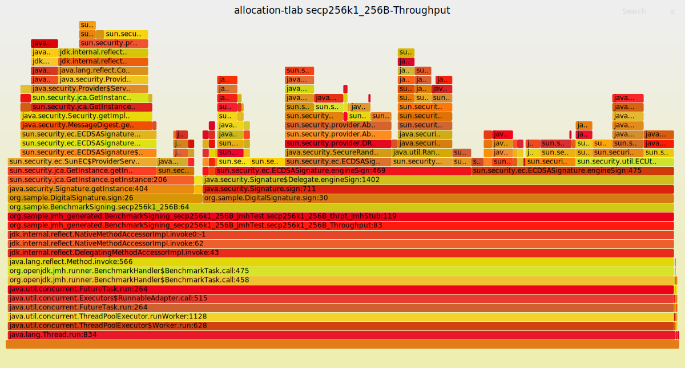

#### 1024B Signing


#### 1024K Signing


#### 128B Verifying

#### 256B Verifying


#### 1024B Verifying


#### 1024K Verifying


### cpu
#### 128B Signing


#### 256B Signing
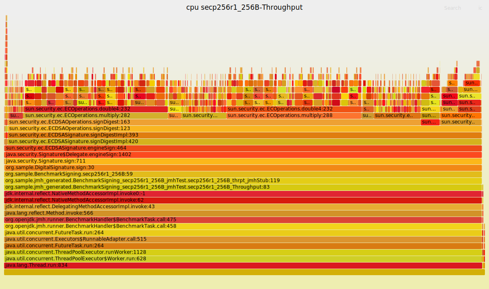


#### 1024B Signing
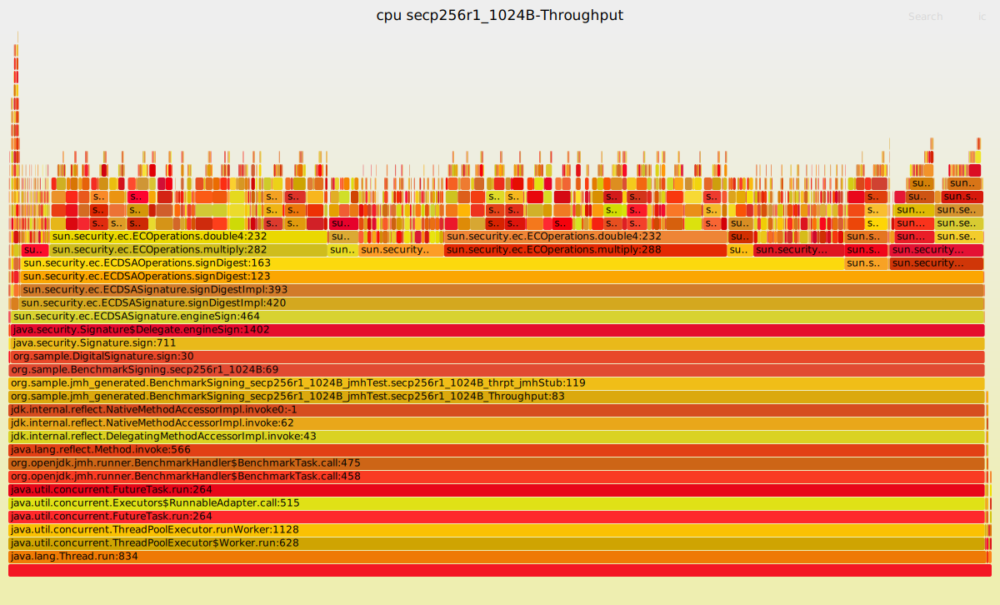

#### 1024K Signing


#### 128B Verifying

#### 256B Verifying


#### 1024B Verifying


#### 1024K Verifying


### alloc
#### 128B Signing


#### 256B Signing


#### 1024B Signing


#### 1024K Signing


#### 128B Verifying

#### 256B Verifying
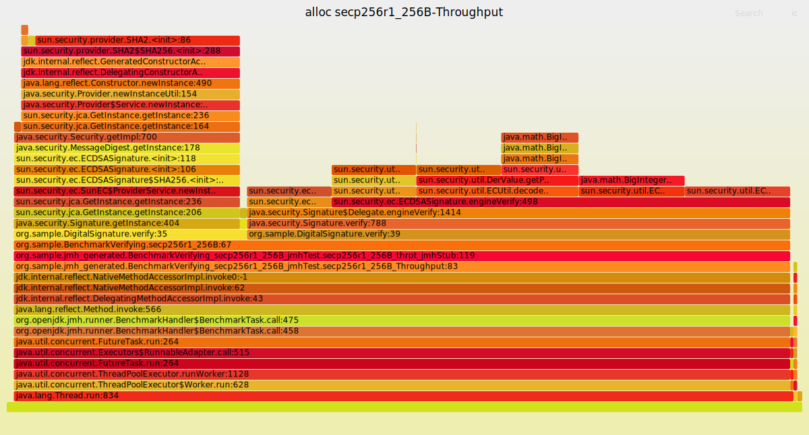


#### 1024B Verifying


#### 1024K Verifying


### io-socket
#### 128B Signing

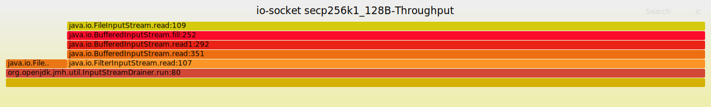

#### 256B Signing
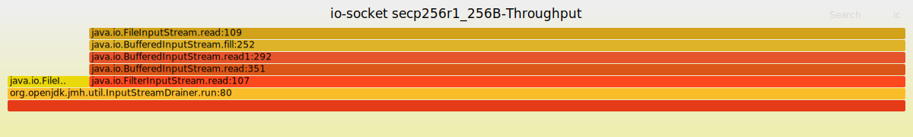


#### 1024B Signing


#### 1024K Signing


#### 128B Verifying

#### 256B Verifying


#### 1024B Verifying


#### 1024K Verifying


### monitor-blocked
#### 128B Signing
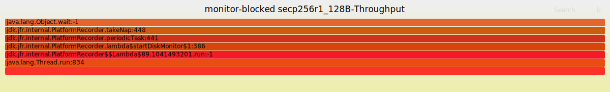


#### 256B Signing


#### 1024B Signing

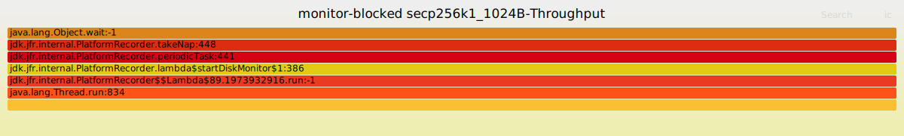

#### 1024K Signing


#### 128B Verifying
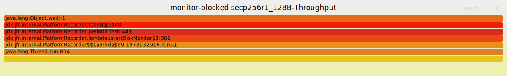
#### 256B Verifying


#### 1024B Verifying


#### 1024K Verifying
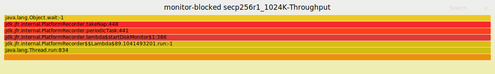
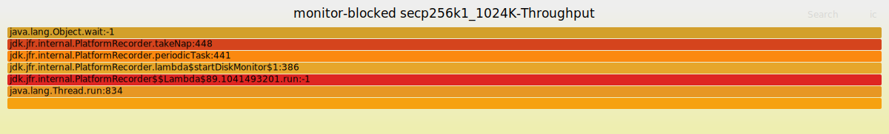
