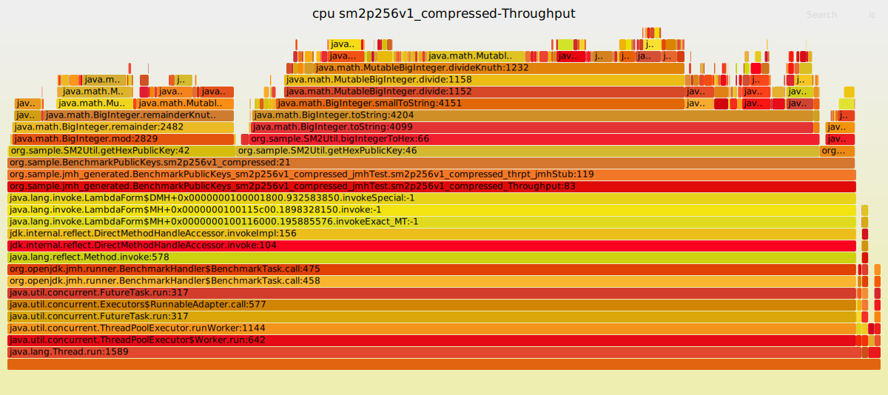
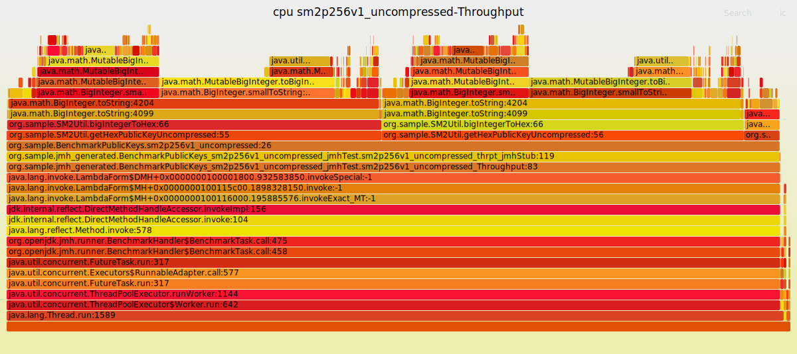
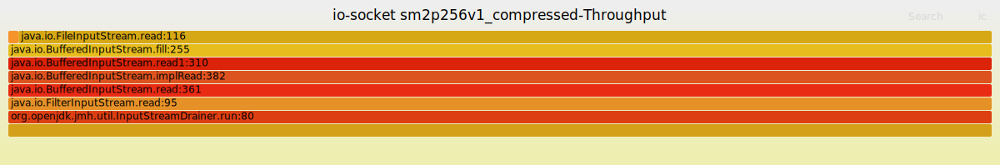
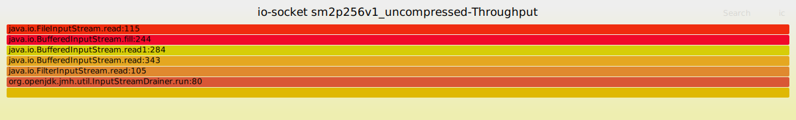
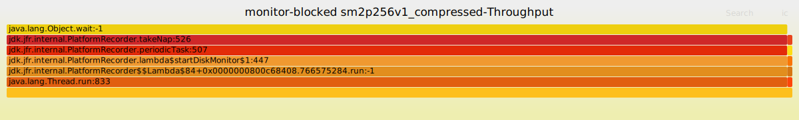
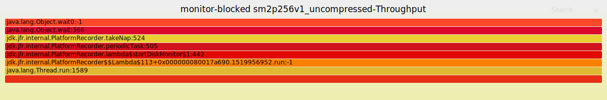

# Demo to Test SunEC sm2p256v1 with Bouncy Castle

Generate the sm2p256v1 key pairs using patches from:
https://github.com/HollowMan6/jdk/tree/sm2

Test the key pairs by digital signature signing and verifying using Bouncy Castle.

JMH Performance test for compressed and uncompressed public key generation.

## Build

***Please use the [patched JDK](https://github.com/HollowMan6/jdk/tree/sm2).***

```sh
mvn clean verify
```

## Run
***Please use the [patched JDK](https://github.com/HollowMan6/jdk/tree/sm2).***
```sh
java -jar target/sm2.jar
```

## Benchmark
***Please use the [patched JDK](https://github.com/HollowMan6/jdk/tree/sm2).***
```sh
mvn -f pom-benchmark.xml clean verify
java -jar target/benchmarks.jar -prof jfr
```

### Result
[result logs](result.log)

The result clearly shows that the compressed public keys generation has a better performance than the uncompressed ones.


## JFR to FlameGraph
Using `jfr-flame-graph`:

```sh
git clone https://github.com/xpbob/jfr-flame-graph
cd jfr-flame-graph && mvn clean verify
java -jar jfr-flame-graph-1.0-SNAPSHOT-jar-with-dependencies.jar -f profile.jfr -e allocation-tlab > allocation-tlab.txt
java -jar jfr-flame-graph-1.0-SNAPSHOT-jar-with-dependencies.jar -f profile.jfr -e cpu > cpu.txt
java -jar jfr-flame-graph-1.0-SNAPSHOT-jar-with-dependencies.jar -f profile.jfr -e monitor-blocked > monitor-blocked.txt
java -jar jfr-flame-graph-1.0-SNAPSHOT-jar-with-dependencies.jar -f profile.jfr -e io-socket > io-socket.txt
java -jar jfr-flame-graph-1.0-SNAPSHOT-jar-with-dependencies.jar -f profile.jfr -e alloc > alloc.txt

git clone https://github.com/brendangregg/FlameGraph.git
cat allocation-tlab.txt | FlameGraph/flamegraph.pl --title "allocation-tlab ${PWD##*.}" > allocation-tlab.svg
cat cpu.txt | FlameGraph/flamegraph.pl --title "cpu ${PWD##*.}" > cpu.svg
cat monitor-blocked.txt | FlameGraph/flamegraph.pl --title "monitor-blocked ${PWD##*.}" > monitor-blocked.svg
cat io-socket.txt | FlameGraph/flamegraph.pl --title "io-socket ${PWD##*.}" > io-socket.svg
cat alloc.txt | FlameGraph/flamegraph.pl --title "alloc ${PWD##*.}" > alloc.svg
```

### cpu



### io-socket



### monitor-blocked


