# Demo to Test the Homemade sm2p256v1 with Bouncy Castle

Generate the sm2p256v1 key pairs by purely mathematical methods, no other dependencies.

Test the key pairs by digital signature signing and verifying using Bouncy Castle.

JMH Performance test for public key generation point multiplication using Standard Projective Coordinates and Jacobian Coordinates.

JMH Performance test for public key generation point multiplication using BinaryExpansion and Addminus method.

JMH Performance test for compressed and uncompressed public key generation using homemade method.

Also test the performance of Bouncy Castle and homemade for generating the sm2p256v1 key.

## Build
```sh
mvn clean verify
```

## Run
```sh
java -jar target/sm2.jar
```

## Benchmark
```sh
mvn -f pom-benchmark.xml clean verify
java -jar target/benchmarks.jar -prof jfr
```

### Result
[result logs](result.log)

For public key generation point multiplication, Addminus is better than BinaryExpansion, and Jacobian Coordinates is better than Standard Projective Coordinates.

The result clearly shows that the uncompressed public keys generation has almost the same performance as the compressed ones.

The performance of Bouncy Castle's generating the sm2p256v1 key is better than the homemade.

## JFR to FlameGraph
Using `jfr-flame-graph`:

```sh
git clone https://github.com/xpbob/jfr-flame-graph
cd jfr-flame-graph && mvn clean verify
java -jar jfr-flame-graph-1.0-SNAPSHOT-jar-with-dependencies.jar -f profile.jfr -e allocation-tlab > allocation-tlab.txt
java -jar jfr-flame-graph-1.0-SNAPSHOT-jar-with-dependencies.jar -f profile.jfr -e cpu > cpu.txt
java -jar jfr-flame-graph-1.0-SNAPSHOT-jar-with-dependencies.jar -f profile.jfr -e monitor-blocked > monitor-blocked.txt
java -jar jfr-flame-graph-1.0-SNAPSHOT-jar-with-dependencies.jar -f profile.jfr -e io-socket > io-socket.txt
java -jar jfr-flame-graph-1.0-SNAPSHOT-jar-with-dependencies.jar -f profile.jfr -e alloc > alloc.txt

git clone https://github.com/brendangregg/FlameGraph.git
cat allocation-tlab.txt | FlameGraph/flamegraph.pl --title "allocation-tlab ${PWD##*.}" > allocation-tlab.svg
cat cpu.txt | FlameGraph/flamegraph.pl --title "cpu ${PWD##*.}" > cpu.svg
cat monitor-blocked.txt | FlameGraph/flamegraph.pl --title "monitor-blocked ${PWD##*.}" > monitor-blocked.svg
cat io-socket.txt | FlameGraph/flamegraph.pl --title "io-socket ${PWD##*.}" > io-socket.svg
cat alloc.txt | FlameGraph/flamegraph.pl --title "alloc ${PWD##*.}" > alloc.svg
```

### BinaryExpansion and Addminus
#### cpu
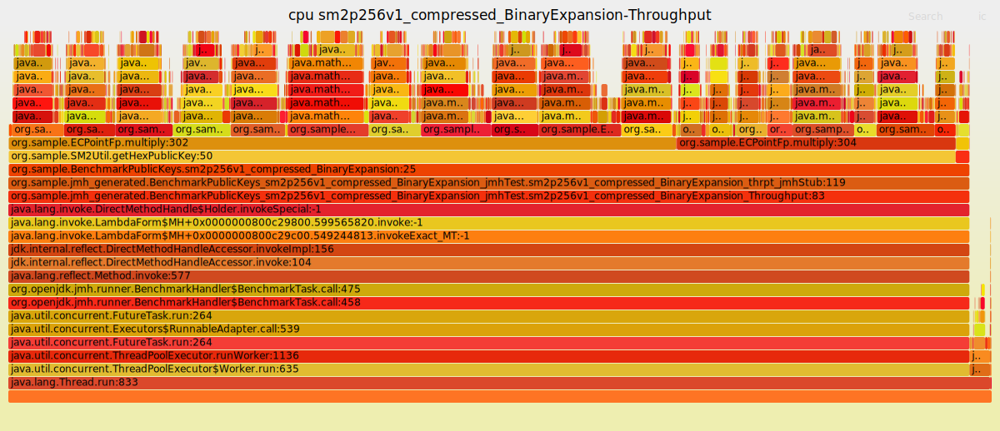


#### io-socket
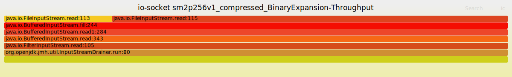


#### monitor-blocked
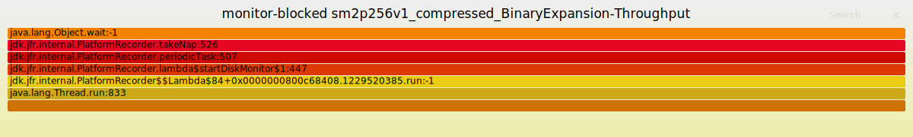


### Compressed and Uncompressed (BinaryExpansion)
#### cpu

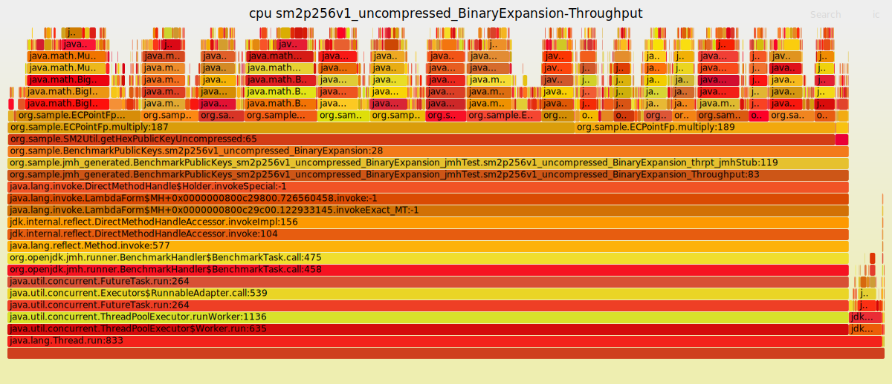

#### io-socket

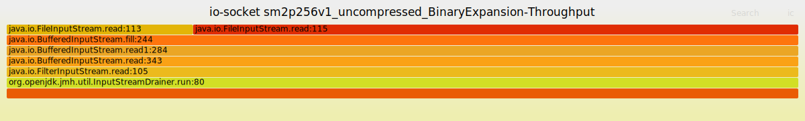

#### monitor-blocked

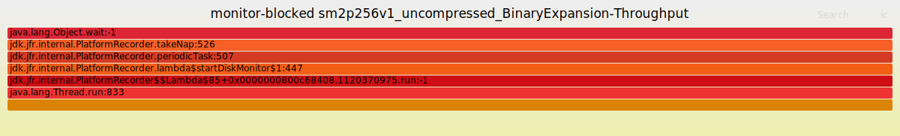

### Compressed and Uncompressed (AddMinus)
#### cpu


#### io-socket


#### monitor-blocked


### Bouncy Castle and Homemade
#### cpu
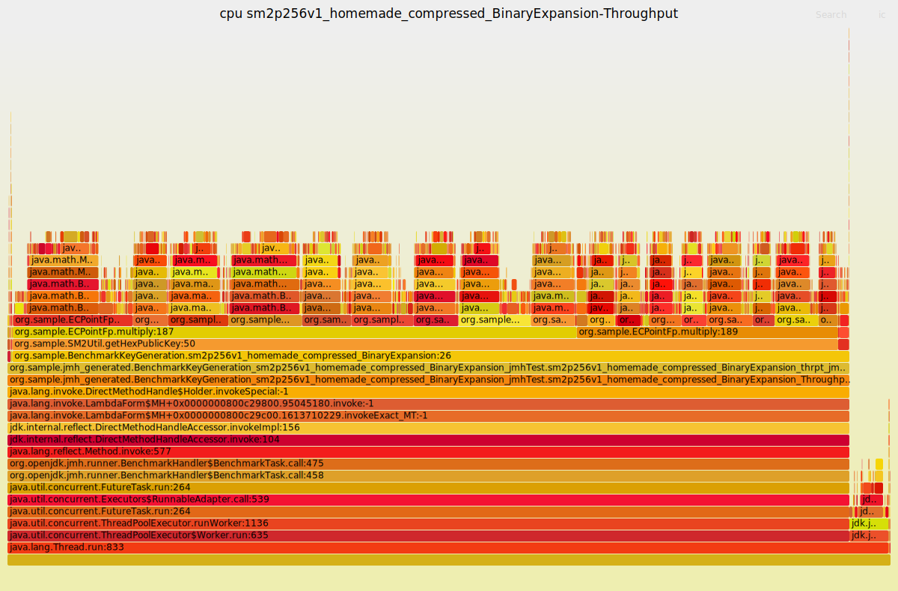
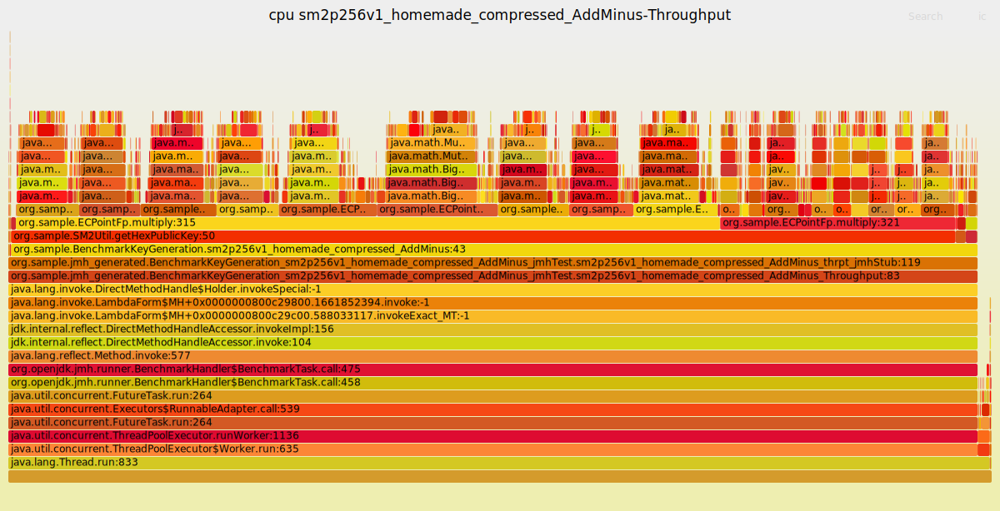
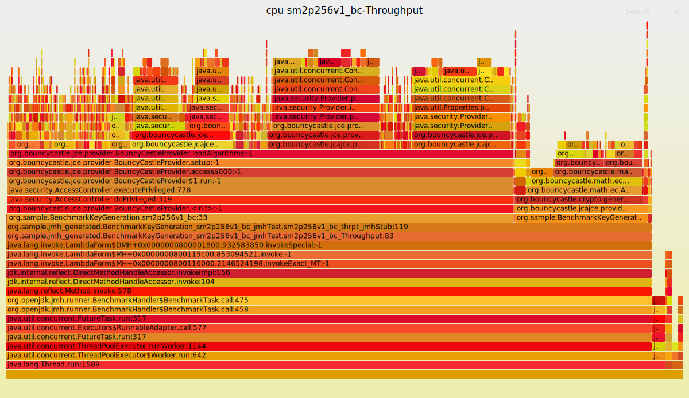

#### io-socket
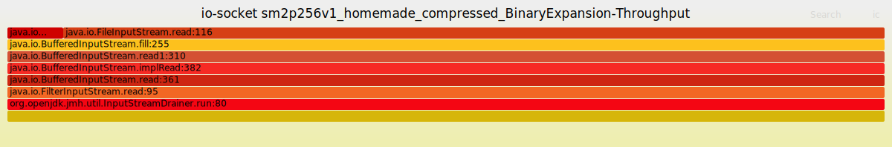
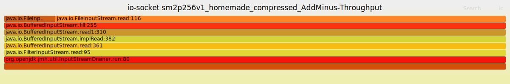
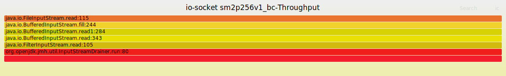

#### monitor-blocked
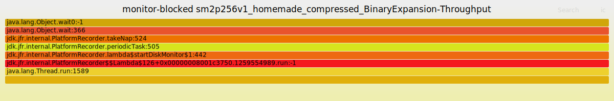

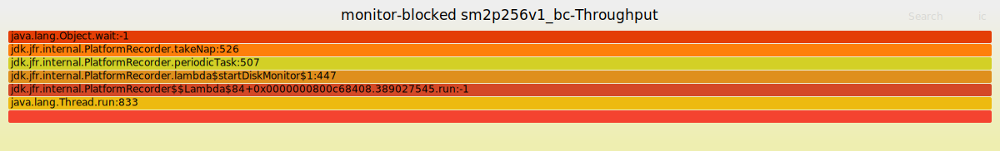
